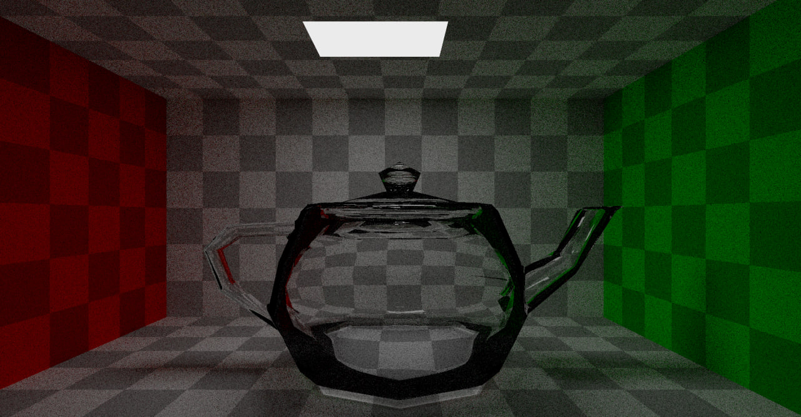
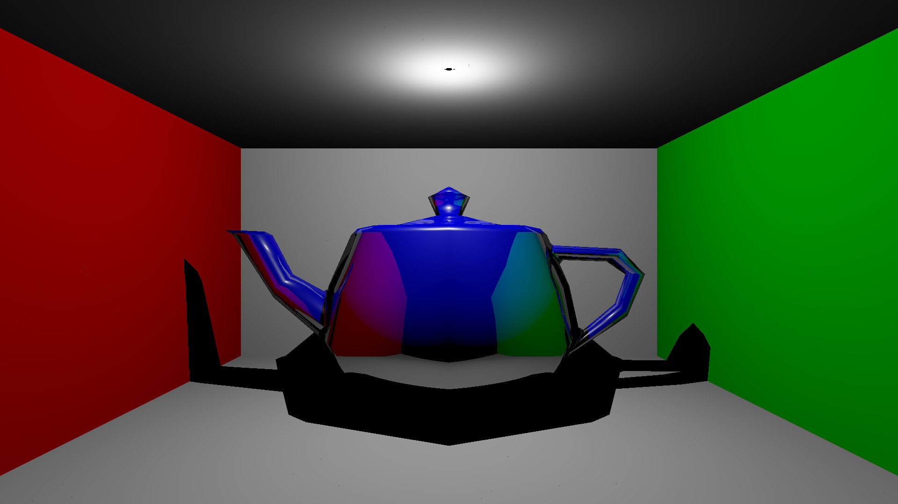
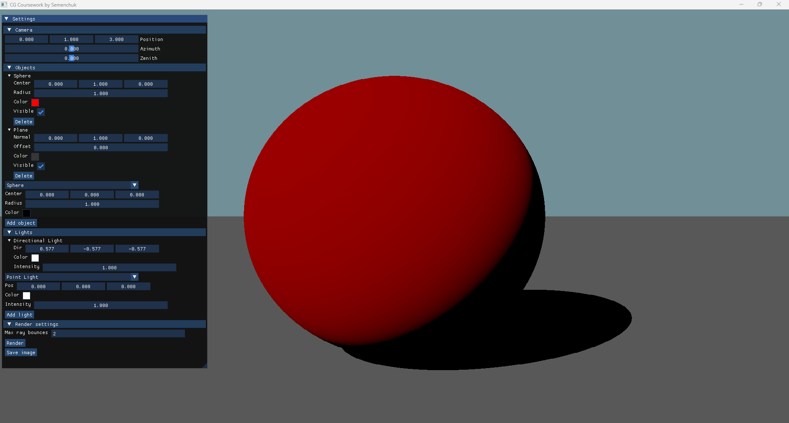

# Компьютерная графика КуР

```
Курсовая работа по дисциплине «Компьютерная графика»
Тема: Конструктор из геометрических примитивов
Язык: C++
Графическая библиотека: SFML
GUI библиотека: Dear ImGui
2025 г.
```

## Examples

- Global illumination (GI)
  

- Blinn-Phong model
  

## GUI features



## Docs

- UML
  

- IDEF0 (Overview)
  

- IDEF0 (Ray tracing)
  


## Build

```
cmake build -B build
cmake build --build build
```
